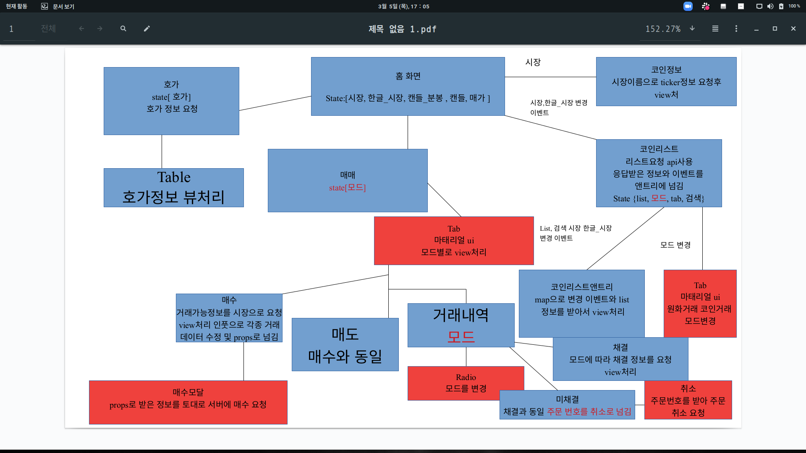
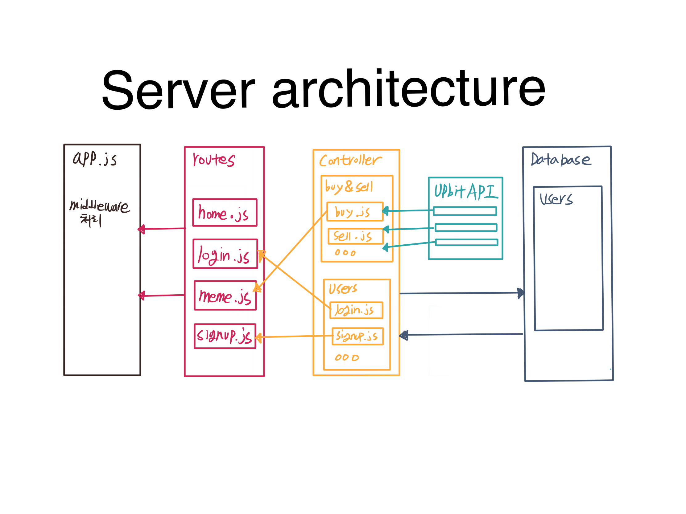
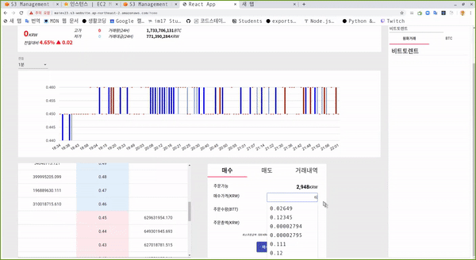

# Tradingbot Project

1. This project is for coin auto trading.

이 프로젝트는 2주 프로젝트로 코인을 자동으로 거래하는게 목적입니다. 

## Info

### architecture
 
  
  

### Install  

1. `cd client npm install`  
client폴더로 이동후 `npm install` 커멘드를 실행하십시오.

### start

1. `npm start`  
`npm start` 커멘드를 입력하여 클라이언트를 실행하십시오.

### stack

1. react hook
2. react-router-dom
2. MATERIAL-UI

### member

1. 조선근 풀스택
2. 김정수 백엔드
3. 서형규 백엔드
4. 조형근 풀스택

## example

  
 

### Progress

1. Implementing login and membership registration functions  
로그인 및 회원가입 기능 구현
2. Implementing Coin Trading and Transaction Details functions  
코인매매 거래내역 기능 구현
3. Automatic transaction function not implemented  
자동거래 기능 미구현

### LICENSE
free software, and may be the distributed under the terms special in the [LICENSE](https://github.com/facebook/react/blob/master/LICENSE) file.

